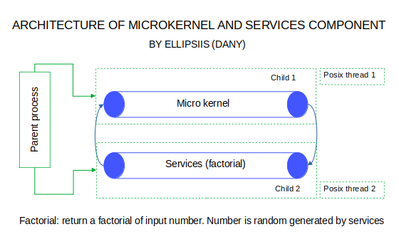

# Microkernel-Service Communication Component
This component simulate the communication beetween microkernel and service that calculate factorial of random number generated by service and this communication will execute 10 times.  
by **ellipsiis :vhs:**
## Introduction
### Operative Systems Structure
Every operative system (generally) have a structure of 4 layers:
1. Hardware (All component which have doing possibel the function of all system like as CPU, GPU, I/O devices and storage)
2. Software (Operative system)
3. System program (Compilers, linkers and assemblers)
4. Application program (Programs where the user can interact with them, videogames, database systems, business programs, etc.)
Tradicionally operative systems assosiates one processor to all process will be executed. Working with Mikrokernel, so that user process can be executed is necessary to have more than an process loaded in memory system, every process must have one execution flow (thread). 
### Microkernel
One of most bigger benefits of Microkernel is capabality to have communications beetween process, port and messages. One port may can be presented by an address where we can send all messages. This port can have a behaivor of inbox to incomming messages that reach the port tail.
Microkernel must manage all incomming user messages and can have client-server behaivor in their communicaton enviroment. 
## Technologies
1. Ansi C
2. GCC Compiler 4.9
3. POSIX Threads
4. GNU/Linux Ubuntu 20.04 focal 
## Requirements
- The communications beetween microkernel and service must be through pipelines. Every pipeline must be right managed with posix threads
- The execution of system must be equal to 10 times
- Services must generate a random number to send through pipeline to calculate factorial and send again to microkernel pipeline
- Clean code and right form in comment every line and function
## Architecture
Following architecture was designed by our component, following requiriments of my teacher.

<p align="center">  <br> a) Architecture to implement pipeline communication </p>


## Build
1. Dowload `client_server.c` file
2. Compile file using a C compiler, I recommend you the GCC compiler that is integrated in any GNU/Linux distribution.
3. In terminal shell (GNU/Linux), change to directory where you was downloaded the source file `client_server.c` and write:
```console
$ gcc client_server.c -o any_name_you_want
```
4. Run executable with `./any_name_you_want.exe`, for example `./client_server.exe`.
5. Enjoy execution :smile:

**ENJOY THIS MICRO-KERNEL MODULE** and fell free to use in your carrer, school or job, **only don't forget mentioned me @ellipsiis in your modification or implementation :thumbsup:**, every code has a lot time of work and long times of think how solve the problem. Share with me your version or upgrade implementation and let's see together your surprise :smile:.
